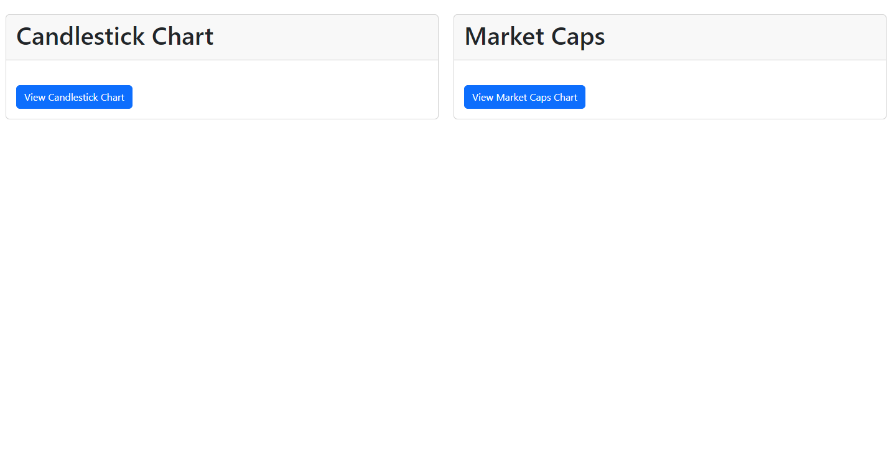
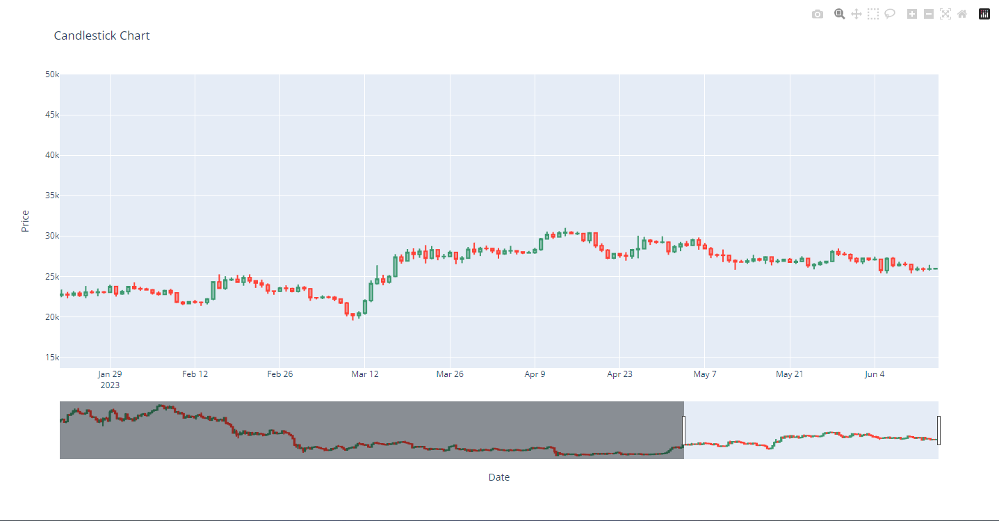
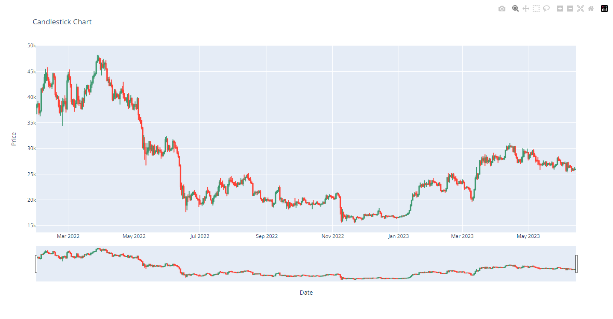
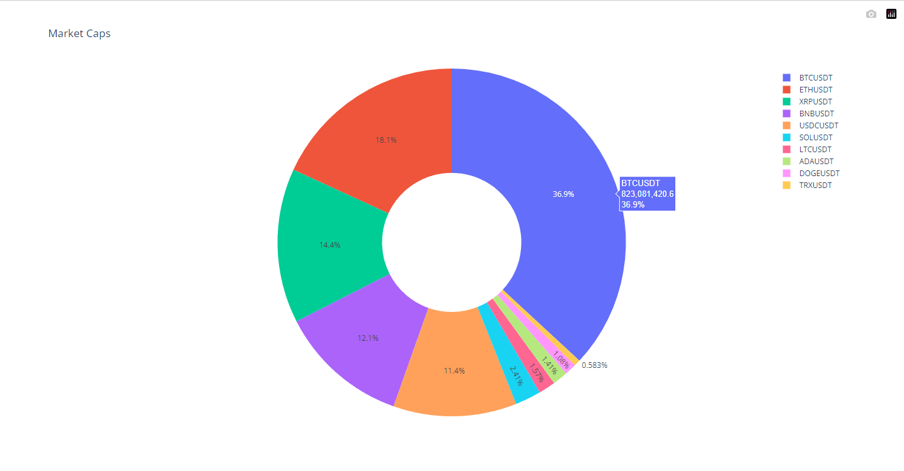

To run the `binance.py` and `app.py` scripts, follow the instructions below:

## Instructions

### Step 1: Clone the repository
Clone the repository containing the scripts to your local machine.
```
git clone https://github.com/danylo-d/algo_zeus_test_task.git
```

### Step 2: Install dependencies
Navigate to the project directory and install the required dependencies by running the following command:
```
pip install -r requirements.txt
```

### Step 3: Configure the API keys
Open the `config.ini` file in the project directory and replace the placeholders `<Providers>` and `<PieChart>` and `<Binance>` with your Data

### Step 4: Run the `binance.py` script
Open a terminal or command prompt, navigate to the project directory, and run the following command to execute the `binance.py` script:
```
python binance.py
```
This script retrieves data from the Binance API and saves it to a CSV file with a filename in the format `symbol_interval_year_month_day_hour_minute_second.csv`.

### Step 5: Run the Flask application
In the same terminal or command prompt, run the following command to start the Flask application:
```
python app.py
```
The Flask application will be running locally at `http://127.0.0.1:5000/`.

### Step 6: View the Candlestick Chart
Open a web browser and visit `http://127.0.0.1:5000/candlestick` to view the Candlestick Chart generated from the CSV data.



### Step 7: View the Market Caps Pie Chart
To view the Market Caps Pie Chart, visit `http://127.0.0.1:5000/market_caps` in your web browser.

Note: Make sure to keep the `binance.py` script running or rerun it periodically to fetch updated data from the Binance API.

That's it! You have successfully run the `binance.py` script to fetch data from the Binance API and displayed it using the Flask application.